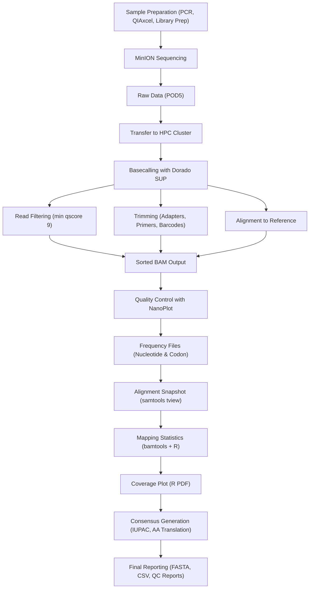

# MyMinion - NGS Pipeline

## Overview
This repository contains an automated analysis pipeline for processing viral whole-genome sequencing data generated using the Oxford Nanopore Technologies (ONT) MinION Mk1C platform.  
The workflow covers all steps from raw signal extraction to consensus generation, variant analysis, and reporting.  
It is optimized for **viral genomes**, where high mutation rates and quasispecies complexity require maximal accuracy.

---

# 1. Laboratory Workflow

## 1.1 Sample Preparation
- Viral target DNA amplified via **nested PCR**.
- Amplicon quality and fragment size verified using **QIAxcel**.
- Library preparation using **ONT SQK-NBD114-24 (Kit14)**:
  - End-repair & dA-tailing  
  - Ligation of barcoded adapters  
  - Sample pooling  
  - Final adapter ligation  
  - Cleanup with AMPure XP beads  
- Prepared library loaded onto the MinION flow cell.

---

# 2. Sequencing Configuration

## 2.1 Barcode Classification
During sequencing, Dorado performs barcode classification in **inline mode**:

- Reads are assigned to barcodes during basecalling.
- Barcode stored in:
  - `BC` tag of each read
  - `RG` (Read Group) in the BAM  

This produces one BAM containing all reads pre-separated by barcode.

---

# 3. Computing Environment

Raw MinION run data are transferred from the Mk1C to the university HPC cluster equipped with **GPU nodes**.  
Basecalling, alignment, QC, and consensus processing occur entirely on this infrastructure.

After computation, all results are synchronized to the diagnostics network storage for downstream clinical interpretation.

---

# 4. Basecalling

## 4.1 Dorado Basecaller
- Uses latest **SUP (Super Accuracy)** model.
- SUP outperforms HAC and Fast models.
- Required due to high viral mutation rates and quasispecies complexity.
- Dorado is actively developed by ONT and maintained on GitHub.

## 4.2 GPU Acceleration
SUP is a **Transformer model** requiring heavy floating-point computation.  
→ GPU mode is used on HPC compute nodes.

---

# 5. Read Filtering

Reads are filtered during basecalling using:

```bash
--min-qscore 9
```
Q = -10 * log10(P)

Where `P` is the basecalling error probability.

Examples:
- **Q9** → approx. 12.5% error  
- **Q30** → later used for strict filtering by bamToFreq  

Reads <Q9 are discarded.

---

# 6. Trimming

With Kit14 (SQK-NBD114-24), Dorado performs trimming automatically unless `--no-trim` is specified.

Trimmed elements:
- ONT adapters  
- Nested PCR primers  
- Native Barcoding (NBD) barcodes  

Read orientation is determined via primer detection (`TS:A:+` / `TS:A:-`).

---

# 7. Alignment

Basecalling and alignment are performed **simultaneously**:

- GPU → basecalling  
- CPU → alignment  

The correct reference (HIV-1, HBV, SARS-CoV-2, etc.) is selected based on the sample sheet.  
A **sorted BAM** is generated for downstream processing.

---

# 8. Quality Control

## 8.1 FASTQ and BAM QC
Reads are extracted from BAM using:

```bash
bedtools bamtofastq
```
Two NanoPlot reports are generated:
1. **FASTQ-based QC**  
2. **BAM-based QC**

NanoPlot outputs include:
- Read length distribution  
- N50  
- Q-score distribution  
- Yield curves  
- Alignment identity  

These metrics determine the suitability for resistance analysis.

---

# 9. Frequency Files

Using **bamToFreq**, two CSV files per sample are generated:

## 9.1 `<sample>_freqs.csv`
Contains:
- Per-base frequencies (A, C, G, T, N, deletions)
- Coverage per position  
→ Supports SNV and minority variant detection.

## 9.2 `<sample>_codonFreqs.csv`
Contains:
- Codon frequencies across the genome  
→ Used for amino-acid–level resistance interpretation.

Strict filtering with:

```bash
-q 30
```
removes low-quality bases.

---

# 10. Alignment Viewer Output

`samttools tview` generates a text-based alignment snapshot (`ngs.txt`) including:
- Reference sequence  
- Stacked reads  
- Mismatches  
- Insertions/deletions  
- Base composition  

This serves as a GUI-independent qualitative review tool.

---

# 11. Mapping Statistics

An R script:
1. Reads genomic region definitions from CSV
2. Counts total reads via:

```bash
bamtools count -in file.bam
```
3. Computes read counts per region  
4. Outputs a table `mapping-tab-date-lab.csv`

This table summarizes genomic coverage per region.

---

# 12. Coverage Plot

The R script:
- Aggregates coverage from `freqs.csv`
- Produces a **PDF coverage plot**

Uses:
- Identifying low- or high-coverage regions  
- Evaluating uniformity of sequencing  
- Documenting data quality for reporting or publications  

---

# 13. Consensus Generation

Consensus sequences are built for thresholds: `1%, 2%, 5%, 10%, 15%, 20%, 30%`


The **10% threshold** is additionally exported as a separate FASTA.

### IUPAC Ambiguity Codes  
Used to encode minority variants.

### Amino Acid Translation
Performed using the R package **Biostrings**:
- Codon frequencies → amino-acid frequencies  
- Redundant codons merged  
- Gene-specific AA tables exported  

Output files include:
- `freqs.csv` (nucleotide frequencies)  
- `freqsC.csv` (codon frequencies)  
- `freqsAA.csv` (amino acid frequencies)  

---

# 14. Pipeline Automation

A Python CLI tool automates the entire workflow.

### Features
- Text-based UI using **textual**
- SSH transfer via **paramiko**
- Automated steps:
  - Run selection (run_YYYYMMDD)
  - Sample sheet selection
  - SCP transfer from Mk1C to HPC
  - GPU basecalling
  - Postprocessing + QC
  - Export to diagnostics directory

### Benefits
- Eliminates manual errors  
- Ensures reproducible processing  
- Saves time for high-throughput scenarios  
- User-friendly interface  

---

# 15. Reporting

All results are exported to a structured output directory:

- QC HTML reports  
- FASTQ files  
- BAM files  
- Coverage plots  
- Frequency tables  
- Consensus FASTA  
- Codon & AA frequencies  
- Alignment snapshots (ngs.txt)

These outputs form the basis for downstream **resistance mutation analysis**.

---
# 16. Pipeline Flowchart



---

# References

1. Capobianchi MR, Giombini E, Rozera G. Next-generation sequencing technology in clinical virology. *Clin Microbiol Infect* [Internet]. 2013 Jan 1 [cited 2025 Nov 28];19(1):15–22. Available from: https://www.sciencedirect.com/science/article/pii/S1198743X14603049

2. Fleischmann WR. Viral Genetics. In: Baron S, editor. *Medical Microbiology* [Internet]. 4th ed. Galveston (TX): University of Texas Medical Branch at Galveston; 1996 [cited 2025 Nov 28]. Available from: http://www.ncbi.nlm.nih.gov/books/NBK8439/

3. Li JZ, Kuritzkes DR. Clinical Implications of HIV-1 Minority Variants. *Clin Infect Dis* [Internet]. 2013 Jun 1 [cited 2025 Nov 28];56(11):1667–74. Available from: https://pmc.ncbi.nlm.nih.gov/articles/PMC3641869/

4. García-González C, García-Bujalance S, Ruiz-Carrascoso G, Arribas JR, González-García J, Bernardino JI, et al. Detection and quantification of the K103N mutation in HIV reverse transcriptase by pyrosequencing. *Diagn Microbiol Infect Dis* [Internet]. 2012 Jan 1 [cited 2025 Nov 28];72(1):90–6. Available from: https://www.sciencedirect.com/science/article/pii/S0732889311003993

5. HIV Drug Resistance Database [Internet]. [cited 2025 Nov 28]. Available from: https://hivdb.stanford.edu/

6. Radford AD, Chapman D, Dixon L, Chantrey J, Darby AC, Hall N. Application of next-generation sequencing technologies in virology. *J Gen Virol* [Internet]. 2012 Sep [cited 2025 Nov 20];93(Pt 9):1853–68. Available from: https://pmc.ncbi.nlm.nih.gov/articles/PMC3709572/

7. Levy SE, Boone BE. Next-Generation Sequencing Strategies. *Cold Spring Harb Perspect Med* [Internet]. 2019 Jul [cited 2025 Nov 20];9(7):a025791. Available from: https://pmc.ncbi.nlm.nih.gov/articles/PMC6601457/

8. McCombie WR, McPherson JD, Mardis ER. Next-Generation Sequencing Technologies. *Cold Spring Harb Perspect Med* [Internet]. 2019 Nov [cited 2025 Nov 20];9(11):a036798. Available from: https://pmc.ncbi.nlm.nih.gov/articles/PMC6824406/

9. Hu T, Chitnis N, Monos D, Dinh A. Next-generation sequencing technologies: An overview. *Hum Immunol* [Internet]. 2021 Nov 1 [cited 2025 Nov 20];82(11):801–11. Available from: https://www.sciencedirect.com/science/article/pii/S0198885921000628

10. Zheng P, Zhou C, Ding Y, Liu B, Lu L, Zhu F, et al. Nanopore sequencing technology and its applications. *MedComm* [Internet]. 2023 Jul 10 [cited 2025 Nov 20];4(4):e316. Available from: https://pmc.ncbi.nlm.nih.gov/articles/PMC10333861/

11. Wang Y, Zhao Y, Bollas A, Wang Y, Au KF. Nanopore sequencing technology, bioinformatics and applications. *Nat Biotechnol* [Internet]. 2021 Nov [cited 2025 Nov 20];39(11):1348–65. Available from: https://pmc.ncbi.nlm.nih.gov/articles/PMC8988251/

12. Dietrich V, Alagna N, Helm M, Gerber S, Butto T. Pod5Viewer: a GUI for inspecting raw nanopore sequencing data. *Bioinformatics* [Internet]. 2024 Dec 1 [cited 2025 Nov 20];40(12):btae665. Available from: https://doi.org/10.1093/bioinformatics/btae665

13. Riaz N, Leung P, Barton K, Smith MA, Carswell S, Bull R, et al. Adaptation of Oxford Nanopore technology for hepatitis C whole genome sequencing and identification of within-host viral variants. *BMC Genomics* [Internet]. 2021 Mar 2 [cited 2025 Nov 20];22:148. Available from: https://pmc.ncbi.nlm.nih.gov/articles/PMC7923462/

14. Tshiabuila D, Choga W, San JE, Maponga T, Van Zyl G, Giandhari J, et al. An Oxford Nanopore Technology-Based Hepatitis B Virus Sequencing Protocol Suitable for Genomic Surveillance Within Clinical Diagnostic Settings. *Int J Mol Sci* [Internet]. 2024 Oct 31 [cited 2025 Nov 22];25(21):11702. Available from: https://pmc.ncbi.nlm.nih.gov/articles/PMC11546910/

15. HPC [Internet]. [cited 2025 Nov 21]. Available from: https://itcc.uni-koeln.de/hpc/hpc

16. Slurm Workload Manager - Quick Start User Guide [Internet]. [cited 2025 Nov 21]. Available from: https://slurm.schedmd.com/quickstart.html

17. Introduction - Dorado Documentation [Internet]. [cited 2025 Nov 27]. Available from: https://software-docs.nanoporetech.com/dorado/latest/basecaller/basecall_overview/

18. Li H. Minimap2: pairwise alignment for nucleotide sequences. *Bioinformatics* [Internet]. 2018 Sep 15 [cited 2025 Nov 20];34(18):3094–100. Available from: https://doi.org/10.1093/bioinformatics/bty191

19. Oxford Nanopore Technologies. Ligation sequencing amplicons - Native Barcoding Kit 24 V14 (SQK-NBD114.24). 2022 [cited 2025 Nov 20]. Available from: https://nanoporetech.com/document/ligation-sequencing-amplicons-native-barcoding-v14-sqk-nbd114-24

20. Q-score - Dorado Documentation [Internet]. [cited 2025 Nov 27]. Available from: https://software-docs.nanoporetech.com/dorado/latest/basecaller/qscore/

21. Alignment - Dorado Documentation [Internet]. [cited 2025 Nov 20]. Available from: https://software-docs.nanoporetech.com/dorado/latest/basecaller/alignment/

22. De Coster W. NanoPlot [Internet]. 2025 [cited 2025 Nov 20]. Available from: https://github.com/wdecoster/NanoPlot

23. Döring M, Büch J, Friedrich G, Pironti A, Kalaghatgi P, Knops E, et al. geno2pheno[ngs-freq]: a genotypic interpretation system for identifying viral drug resistance using next-generation sequencing data. *Nucleic Acids Res* [Internet]. 2018 Jul 2 [cited 2025 Nov 23];46(W1):W271–7. Available from: https://doi.org/10.1093/nar/gky349

24. matdoering. bamToFreq [Internet]. 2025 [cited 2025 Nov 24]. Available from: https://github.com/matdoering/bamToFreq

25. samtools-tview(1) manual page [Internet]. [cited 2025 Nov 24]. Available from: https://www.htslib.org/doc/samtools-tview.html

26. Vercauteren J, Vandamme AM. Algorithms for the interpretation of HIV-1 genotypic drug resistance information. *Antiviral Res* [Internet]. 2006 Sep 1 [cited 2025 Nov 27];71(2):335–42. Available from: https://www.sciencedirect.com/science/article/pii/S0166354206001306

27. Obermeier M, Pironti A, Berg T, Braun P, Däumer M, Eberle J, et al. HIV-GRADE: A Publicly Available, Rules-Based Drug Resistance Interpretation Algorithm Integrating Bioinformatic Knowledge. *Intervirology* [Internet]. 2012 [cited 2025 Nov 27];55(2):102–7. Available from: https://karger.com/article/doi/10.1159/000331999

28. Bergström A. Improving data archiving practices in ancient genomics. *Sci Data* [Internet]. 2024 Jul 10 [cited 2025 Nov 21];11:754. Available from: https://pmc.ncbi.nlm.nih.gov/articles/PMC11236975/

29. S1-Leitlinie „Molekulargenetische Diagnostik mit Hochdurchsatz-Sequenzierverfahren (Massives Paralleles Sequenzieren, MPS)“. *Med Genet* [Internet]. 2025 Jul 15 [cited 2025 Nov 21];37(3):209–25. Available from: https://www.degruyterbrill.com/document/doi/10.1515/medgen-2025-2026/html

30. Standards and Guidelines for Validating Next-Generation Sequencing Bioinformatics Pipelines. *J Mol Diagn* [Internet]. [cited 2025 Nov 21]. Available from: https://www.jmdjournal.org/article/S1525-1578(17)30373-2/fulltext

31. Geno2pheno 454 [Internet]. [cited 2025 Nov 29]. Available from: https://454.geno2pheno.org/index.php
